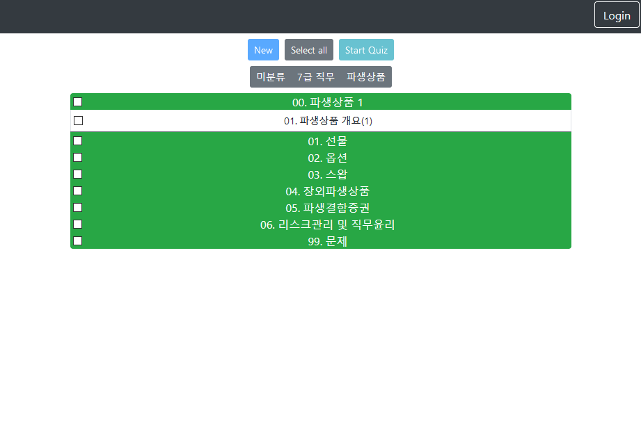
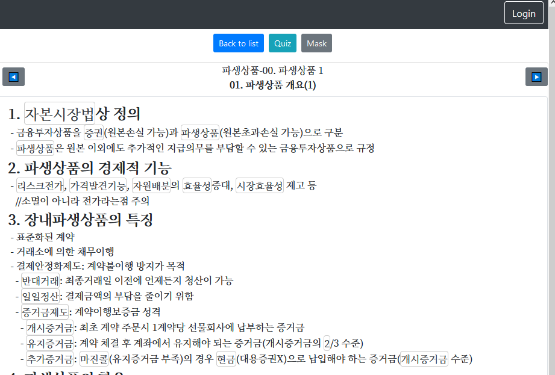
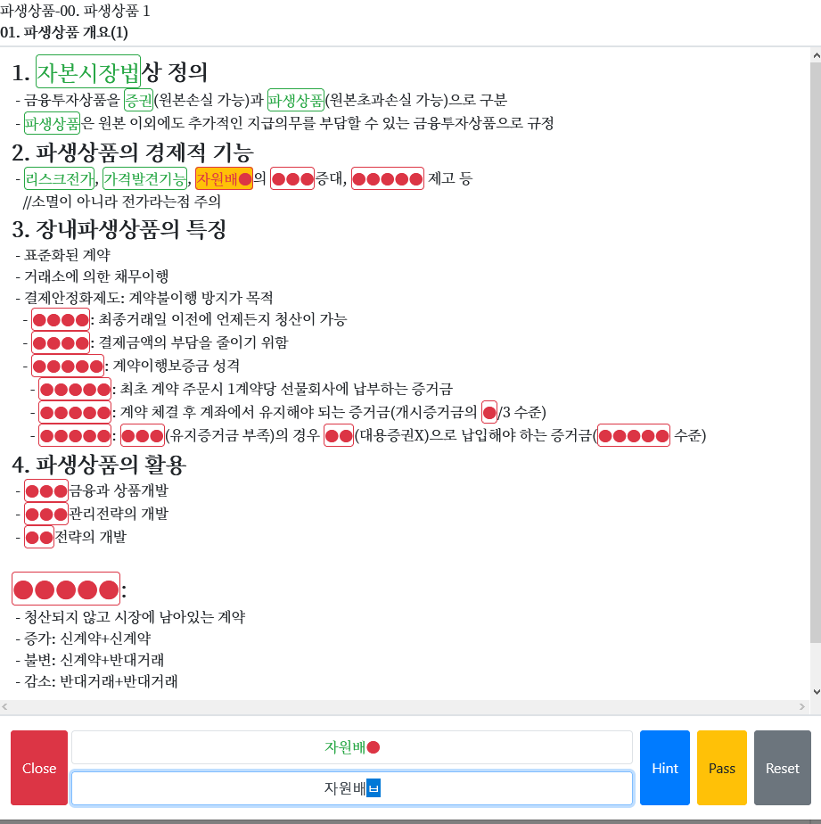
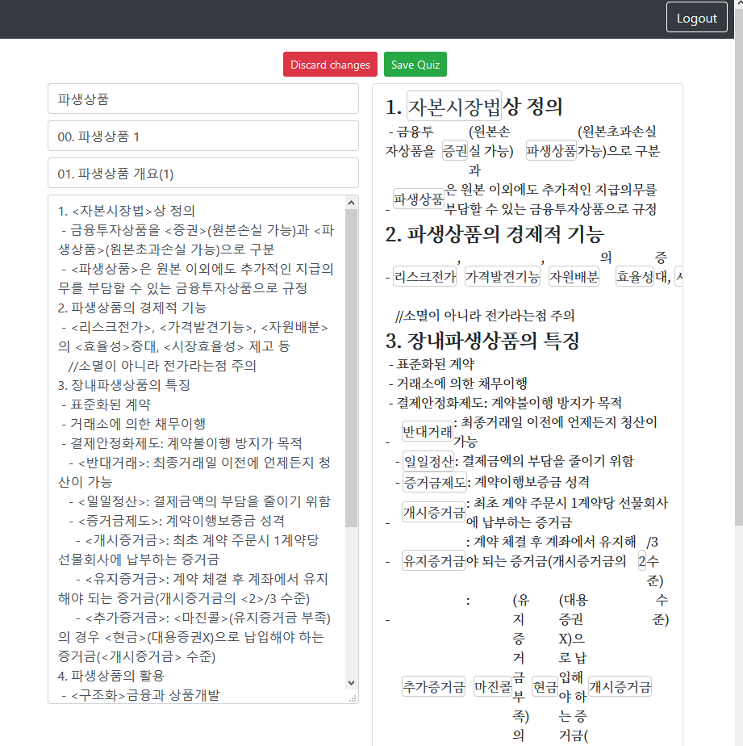

# Read-N-Save

# 개요
기계적인 학습을 도와주는 프로그램

0. 사전준비
1. Firebase 프로젝트 생성
5. React 프로젝트 컴파일하기
6. React에서 Firebase Hosting 기능 사용하기

# 사전준비

`npx create-react-app react-with-firebase`    
`npm i -g serve firebase-tools`  
`npm i react-bootstrap bootstrap firebase @react-firebase/auth @react-firebase/database`  

# Firebase 프로젝트 생성
[Firebase Console](https://console.firebase.google.com/)  
0. 위 사이트에서 프로젝트 추가
0. Authentication -> Sign-in method 에 구글 사용설정
0. Realtime Database -> 규칙에 `src/FirebaseRule.json` 붙여넣기
0. 프로젝트 개요 오른쪽의 설정 버튼을 누르면 밑에 나오는 Firebase SDK Snippet 에서 firebaseConfig JSON을 `src/FirebaseConfig.json`에 적용

# React 프로젝트 컴파일하기

`npx react-scripts build`

# React 프로젝트 호스팅 하기 
`firebase` 명령어를 찾을 수 없다면 `npx firebase` 를 사용해주세요.
## 레포지토리와 Firebase 연결(최초 1회만 실행)
- `firebase login` 
  - `Allow Firebase to collect anonymous CLI usage and error reporting information?` -> `Y`
- `firebase init`
  - `Which Firebase CLI features ...` -> `Hosting` Space 눌러 체크하고 엔터
  - `Select a default Firebase project ...` -> `위에서 만든 Firebase 프로젝트 선택`
  - `What do you want to use as our public directory?` -> `build`
  - `Configue as a single-page app (rewrite all urls to /index.html)?` -> `Yes`
## Firebase Hosting에 배포하기
`firebase deploy`  
이후 Firebase Console->Hosting 에서 알려주는 Domain(예: `read--n-save.firebaseapp.com`)로 접속후 확인
  
# References

[Bootstrap 기본](https://getbootstrap.com/docs/4.5/utilities/borders/)  
[React에서 Firebase 인증사용하기](https://react-firebase-js.com/docs/react-firebase-auth/getting-started)  
[React에서 Firebase 실시간 DB 사용하기](https://react-firebase-js.com/docs/react-firebase-realtime-database/getting-started)  
[React에서 Bootstrap 사용하기](https://react-bootstrap.github.io/components/alerts)https://firebase.google.com/docs/hosting/quickstart)  
[Firebase Hosting 하기](https://firebase.google.com/docs/hosting/quickstart)
